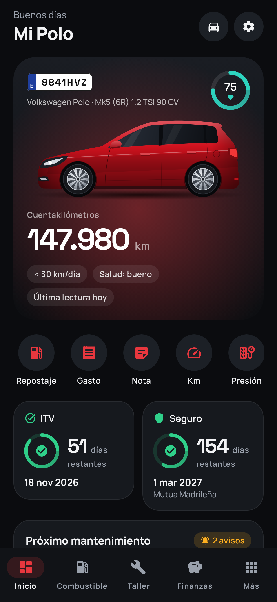
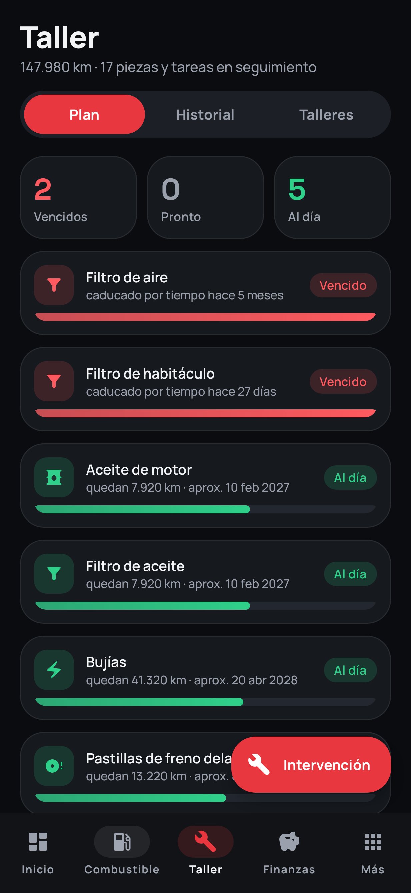
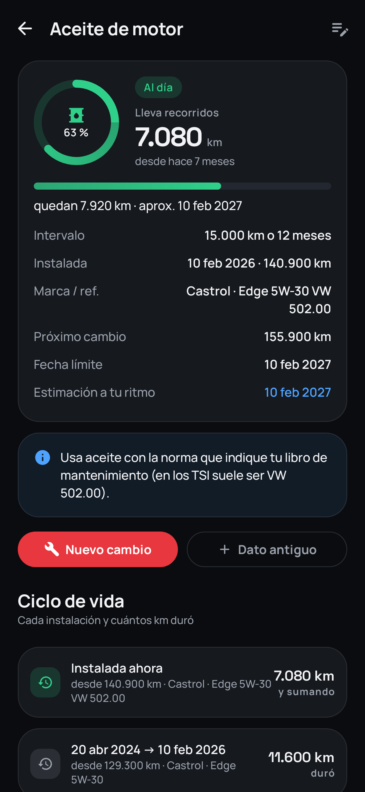
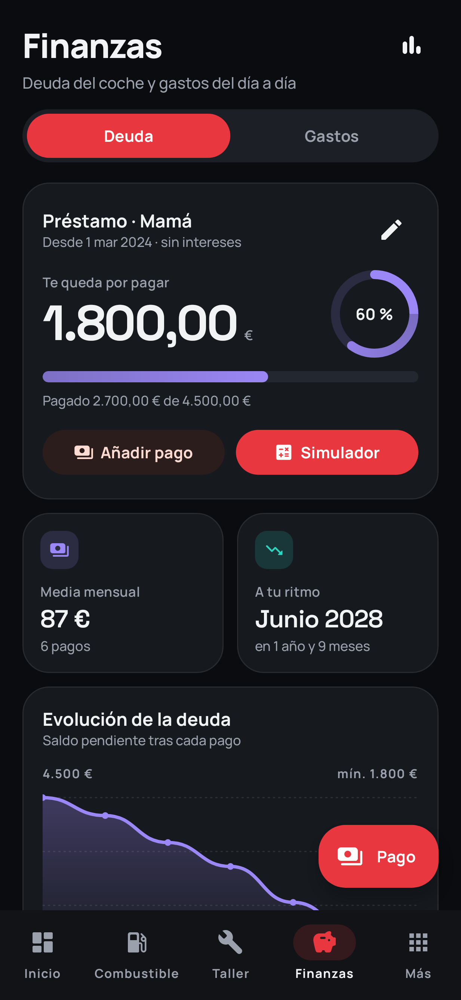
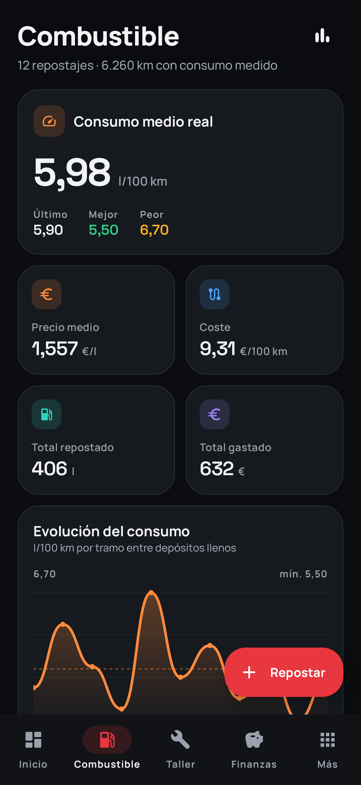
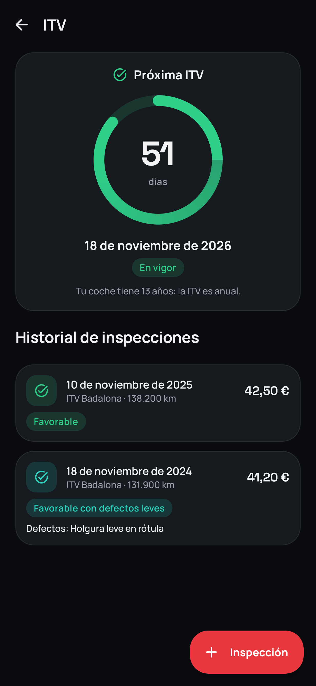
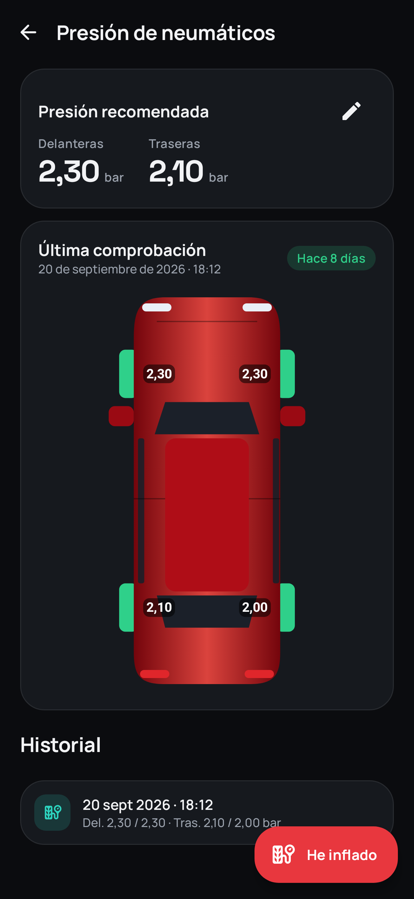
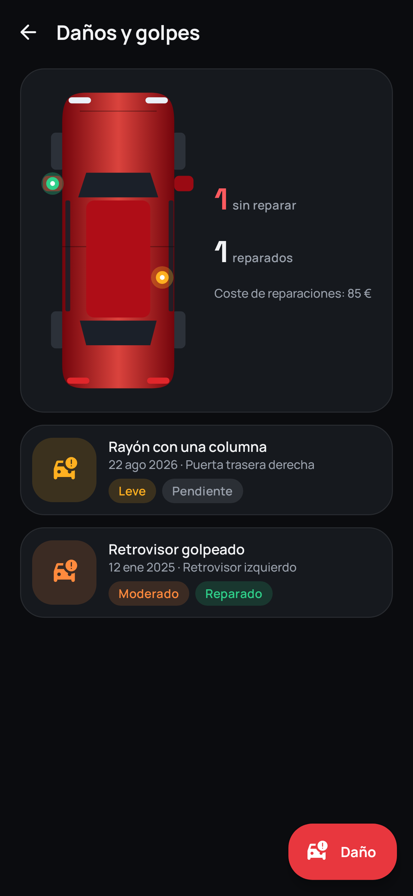

# Polo App

App Android nativa (Kotlin + Jetpack Compose) para llevar el control completo de un coche: mantenimiento con contador de km por pieza, consumo real, ITV, seguro, deuda, viajes, daños, documentos y un **informe PDF para vender el coche** con todo el historial.

Pensada para un **Volkswagen Polo Mk5 (6R) 1.2 TSI 90 CV de 2013**, pero preparada para cualquier coche y para varios vehículos. Funciona **sin conexión**: todo se guarda en el móvil (Room + DataStore).

<p>
  
  
  
  
</p>
<p>
  
  
  
  
</p>

Todas las capturas están en [`docs/screenshots`](docs/screenshots). Se generan automáticamente con un test que usa la app real.

## Instalar en el móvil

1. Entra en la pestaña **Releases** del repositorio desde el móvil y descarga el último `PoloApp-x.y.z-buildN.apk`.
2. Ábrelo. Si Android lo pide, permite *instalar apps de origen desconocido* para el navegador o el gestor de archivos.
3. Las versiones nuevas se instalan **encima** de la anterior y conservan los datos: todas las builds van firmadas con la misma clave.

Requisitos: Android 8.0 o superior (probada para un Galaxy A55).

## Funciones

| Sección | Qué hace |
| --- | --- |
| **Inicio** | Km animados con la ilustración de tu coche (color configurable), puntuación de salud 0-100, cuentas atrás de ITV y seguro, próximo mantenimiento con barra de vida, deuda restante, consumo y accesos rápidos (repostaje, gasto, nota, km, presión y daño). |
| **Combustible** | Repostajes con cálculo del tercer dato (litros, €/l o total). Consumo real por el método lleno a lleno (con repostajes parciales y "olvidé anotar el anterior"), mejor y peor tramo, €/100 km y gráficas. |
| **Taller** | Plan de mantenimiento precargado para el 1.2 TSI (cadena EA111) con intervalos editables por km y/o tiempo. Cada pieza cuenta los km desde su instalación y guarda su ciclo de vida (cuántos km duró cada una). Intervenciones en taller o por tu cuenta, con desglose de costes, piezas (marca y referencia), nº de factura y fotos. Agenda de talleres con valoración y botón de llamada. |
| **Finanzas** | Préstamo sin intereses con historial de pagos, progreso, media mensual real y fecha estimada de fin. Simulador por cuota mensual o por fecha objetivo, con pagos extra y calendario mes a mes. Gastos generales (impuesto, parking, peajes, lavados, multas…). Bloqueo opcional con huella o PIN. |
| **Viajes y notas** | Viajes largos con km, motivo, peajes y coste estimado de combustible. Notas fijables en el inicio y recordatorios con notificación. |
| **ITV y seguro** | Próxima ITV calculada con la normativa española (anual a partir de 10 años, regla de los 30 días), historial con resultado y defectos. Pólizas con renovación rápida y llamada a la asistencia en carretera. |
| **Presiones** | "He inflado": guarda día y hora, compara con la presión recomendada y la muestra rueda a rueda. |
| **Daños** | Toca la zona en la vista cenital del coche, añade fotos, gravedad, reparación y coste. |
| **Guantera digital** | Permiso de circulación, ficha técnica, póliza, informes de ITV… en foto o PDF. |
| **Estadísticas** | Coste total, €/km, gasto mensual por tipo, reparto de costes, km por mes y consumo. |
| **Informe PDF** | Portada con el coche, kilometraje registrado y comprobado, mantenimientos con taller, estado de las piezas, ITV, daños, consumo y anexo con fotos de facturas. Se puede ocultar precios, matrícula, bastidor o propietario. **La deuda y las notas nunca se incluyen.** |
| **Avisos y widget** | Notificaciones de ITV y seguro (30, 7 y 1 día antes), mantenimiento próximo o vencido, presiones y recordatorios. Widget de escritorio con km, ITV, seguro y próximo mantenimiento. |
| **Copia de seguridad** | Exporta e importa un único `.zip` con los datos y las fotos. |

## Arquitectura

- **UI**: Jetpack Compose + Material 3, tema propio (grafito oscuro con acento rojo, modo claro y Material You opcional). Tipografías Manrope (texto) y Space Grotesk (cifras), incluidas en la app.
- **MVVM**: cada pantalla tiene su `ViewModel` (Hilt) que expone `StateFlow`; los formularios usan estado de Compose.
- **Datos**: Room (19 tablas + la vista `odometer_events`, que une en una sola línea temporal todos los registros con km) y DataStore para los ajustes. La lógica de negocio es Kotlin puro en `domain/` y tiene tests unitarios.
- **Otros**: WorkManager (avisos), Glance (widget), PdfDocument (informe), Coil (fotos), kotlinx.serialization (copias y rutas de navegación tipadas).

```
app/src/main/java/com/callankan/poloapp/
├── data/
│   ├── db/            PoloDatabase, entidades (entity/), DAOs (dao/), conversores
│   ├── repository/    Repositorios por dominio + OverviewRepository (resumen del coche)
│   ├── settings/      Ajustes con DataStore
│   ├── files/         Fotos y PDFs adjuntos (almacenamiento privado)
│   ├── backup/        Copia de seguridad .zip
│   └── preset/        Plan de mantenimiento, colores y datos del Polo
├── domain/            Consumo, piezas, deuda, ITV, salud, costes, kilometraje
├── feature/           Pantallas + ViewModels (dashboard, fuel, maintenance, finance, …)
├── ui/                Tema, componentes, gráficas, ilustraciones del coche
├── report/            Motor de maquetación y generador del informe PDF
├── notifications/     Avisos diarios (WorkManager)
├── widget/            Widget de escritorio (Glance)
└── navigation/        Rutas tipadas y NavHost
```

## Compilar

```bash
./gradlew assembleDebug          # APK de desarrollo
./gradlew assembleRelease        # APK optimizado (R8)
./gradlew testDebugUnitTest      # tests: lógica + recorrido completo de la app con Robolectric
./gradlew recordRoborazziDebug   # regenera las capturas de docs/screenshots
```

También se abre directamente con Android Studio. GitHub Actions compila, ejecuta los tests y publica el APK en *Releases* en cada push a `main`. Además, lo prueba en un emulador Android: genera un informe PDF real, abre la app y recorre la versión de release guardando capturas (rama `ci-report-preview`).

## Notas

- **Firma**: `app/keystore/polo-app.jks` está en el repositorio para que todas las builds se puedan actualizar sin desinstalar. Si algún día se publica en Google Play, hay que crear una clave privada nueva y no subirla al repositorio.
- **Intervalos de mantenimiento**: son orientativos. Revisa el libro de mantenimiento de tu coche y ajústalos en *Taller → pieza → editar*.
- Tipografías bajo licencia SIL Open Font License (`licenses/`).
